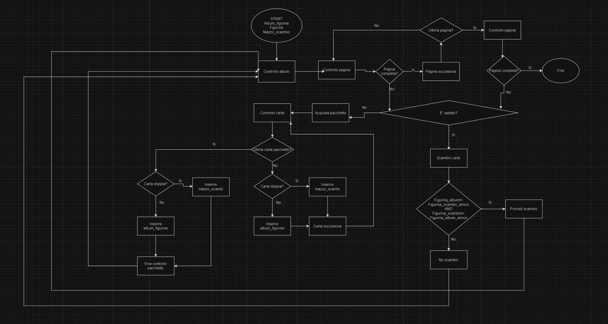

# Human code

---

Creazione di un algoritmo con annesso flow-chart inerente al testo dell' esercizio sottostante.

---

## Aprire un pacchetto di figurine

---

#### Testo dell' esercizio

Che emozione, ogni volta che apro un pacchetto nuovo... chissà se troverò quella figurina così rara!
Dopo averle sfilate dal pacchetto, me le passo tra le mani controllando nell’album: attacco subito quelle nuove, mentre le doppie le metto in un mazzetto a parte. Ormai ne sto accumulando diverse, spero di riuscire a combinare diversi scambi sabato con i miei amici! 

---

#### Deduzioni

Lo scopo e' quello di creare un algoritmo funzionale per riuscire a completare l' album di figurine, gestendo la parte dei controlli e quella degli scambi.

---

## Algoritmo

---

1. **Controllo album**
Procediamo al controllo del nostro album di raccolta per verificarne la completezza.

---

2. **Controllo pagina**
Controlleremo pagina per pagina fino ad arrivare all' ultima pagina, che, se anche quest' ultima dovesse risultare completa porrebbe fine al nostro algoritmo, altrimenti proseguiremo controllando il tipo di giornata.

---

3. **Controllo giornata**
E' la giornata degli scambi? Se cosi' fosse procederemo ad effettuare i nostri scambi con controlli di tipo AND con eventuali possibili scambi, se non ne troviamo o alla conclusione di quest' ultimi torneremo al controllo dell' album.
Nel caso non fosse la giornata degli scambi procederemo all' acquisto dei pacchetti.

---

4. **Acquisto pacchetto** 
Dopo l' acquisto del pacchetto andremo a controllare carta per carta, dividendo i doppioni, inserendoli nel mazzo degli scambi dalle figurine che ci interessano che nadremo a posizionare nell' album, prima pero' capiremo se questa e' l'ultima carta del pacchetto, se cosi' fosse al termine del controllo ripartiremo da inizio algoritmo per valutare la completezza dell' album.

---

##Anteprima

---

